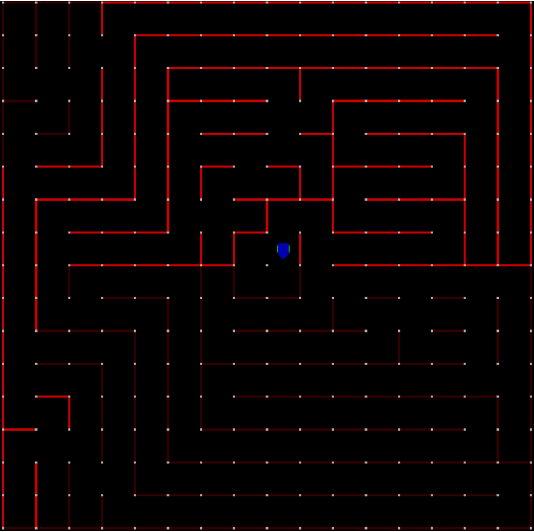

# Virtual-Micromaze

This repo contains code written for the competition
Virtual Micro Mouse Maze Challenge conducted by Shaastra 2021 in which
I was placed 3rd.

This is built on the mms-simulation made by [mackorone](https://github.com/mackorone/mms).
Instructions on how to setup the simulation found in his repo. An 
additional API mms-python to interact with the simulator is linked
to in his repo. This code is built on that API.

The rules for this version of the competition can be found in 
[Online Mouse Maze Challenge] . The rules are slightly different, so
the fork by [whitezeta](https://github.com/whitezeta/mms) has to be used.

The algorithms developed by other participants can be found in the
folder Competitor's Algos.

For more examples of mazefiles for testing or otherwise checkout [mazefiles](https://github.com/micromouseonline/mazefiles)

